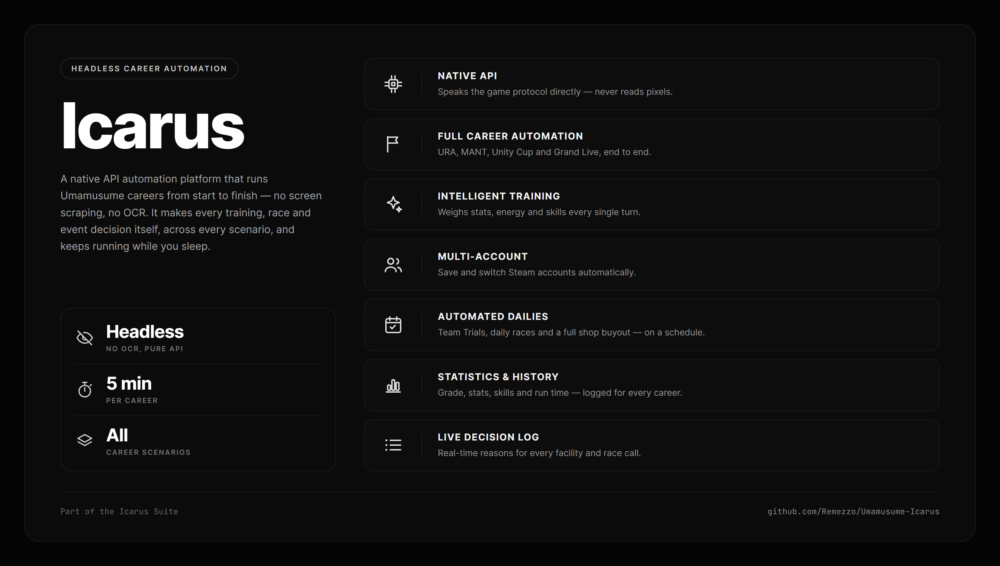
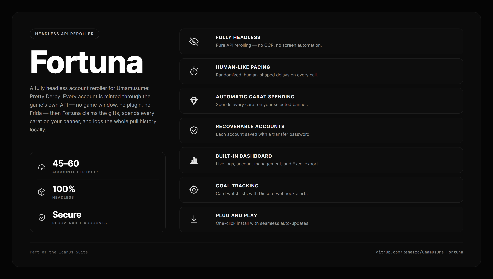
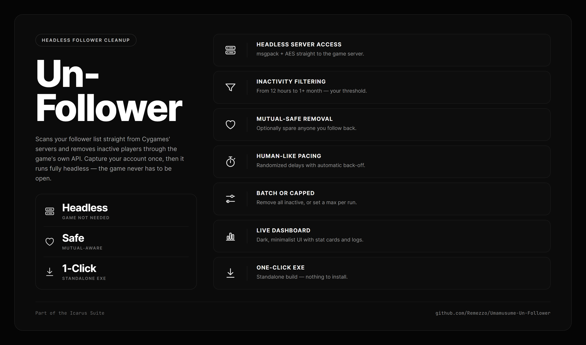
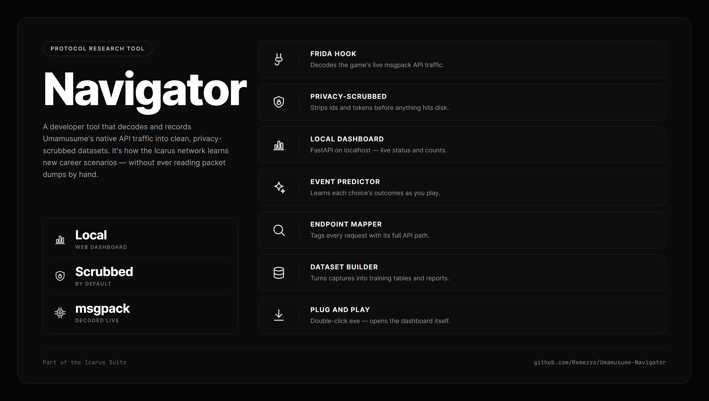

# Umamusume Overseer

**The companion overlay that makes Umamusume yours.** Read every screen in your own language, breeze past the parts you've seen a hundred times, and run it all from a clean, professional dashboard — on your own machine.

You control Overseer from a **minimalist web control panel** that opens in your browser at **http://127.0.0.1:1620** — a calm, uncluttered dashboard where every setting is a click away and nothing needs a manual. Prefer to stay in the game? A tap of **Insert** brings up a quick in-game overlay for the essentials. Nothing runs off playing the game for you — every choice stays yours.

Works on both the **Global** and **Japanese** Steam clients.

## Why you'll want it

- **Play in your language.** Live translation of menus, dialogue, skills, events and story — pulled from the game's real text, so names stay names and numbers stay numbers. English works on the Japanese client too, so you can jump on JP content early and still read everything.
- **Skip the reruns.** One tap clears event screens, training cut-ins, race results and shop animations, using the game's own fast-forward — instant, and never out of step with the UI.
- **Handle Team Trials faster.** Swap your whole 15-Uma lineup in one click, and let Overseer hunt down a specific opponent for you while you're away.
- **Make it run smooth.** Unlock the frame rate, force max model quality, or strip everything down for a weak PC — your call, one switch each.
- **Run it from one clean screen.** A minimalist, professional web dashboard puts every feature a click away — no clutter, no learning curve, nothing to wrestle with.
- **Stays yours.** Everything runs locally. Your translations, settings and data never leave your PC.

## Install

No build tools, no terminal.

1. Close the game.
2. Run **`install.ps1`** (right-click → *Run with PowerShell*).
3. Launch the game — the overlay loads with it. Use **Windowed** or **Borderless** so it shows.
4. Press **Insert** for the menu, or open **http://127.0.0.1:1620**.

Run **`uninstall.ps1`** to remove it. Everything Overseer needs is bundled in.

## What's inside

### Translation
- **Live, in-game translation** of the whole interface, dialogue, skills, events and story — on both the Global and Japanese clients.
- **Accurate by design.** Text comes from the game's own strings, not screenshots, so a stat reads exactly and a character's name is never turned into gibberish. A protected glossary locks the terms that have to be right.
- **A three-part engine:** a hand-tuned glossary for the important terms, a cache for anything already seen, and an on-device neural model for everything else — no cloud, nothing sent anywhere. Flip to the high-quality model when you want the best wording, or keep the light one when you want it lean.
- **Make it yours:** fix any line by hand and Overseer remembers it, import/export your glossary, and browse everything it just translated.

### Skip & speed
- **One-tap skips** for events, training cut-ins, race results and the shop, each toggleable, each driven by the game's *own* skip so it's fast and safe.
- **Races only fast-forward when you won** — lose, or a result that isn't known yet, and it stops so you can decide. It never touches Team Trials.
- **Game speed slider** (1×–10×) for menus, transitions and event text.
- **Auto-unfollow** clears out your followers list at a natural pace while you do something else.

### Career tracking & guidance
- **Career dashboard** tracks each run — stats, actions, results — as you play.
- **Predictions & reveal** surface what's knowable about a race ahead of time.
- **Live Advisor** gives a plain-language read on the turn in front of you: what's worth doing and why. It only ever *suggests* — you make every call.

### Legacy & inheritance
- **Exact succession affinity** shown right on the Legacy Select screen as draggable, resizable badges — the real number the game itself uses.
- **An affinity table built from your own play**, so it's always accurate and never a stale shipped list.
- **Loop planner** — pick a handful of characters and Overseer finds the rotation that keeps every career feeding the next at top affinity.
- **Spark visualization** across your roster and career reports.

### Team Trials
- **Deck profiles** — save your whole 15-Uma lineup and swap it back in one click; keep up to five named teams. Each profile pins the exact Umas, so it survives an inventory reshuffle and warns you rather than saving a broken team.
- **Opponent finder** — kick off an auto-refresh of the opponent list and walk away; when a trainer you named shows up it stops and pings you with an on-screen banner, a Windows notification and a flashing taskbar.
- **Result capture** saves each Team Trials result you view for later.

### Performance & visuals
- **Frame rate** — cap it anywhere from 1–300, or unlock it entirely, with a true measured FPS counter.
- **Max 3D quality** beyond the in-game cap, plus **uncapped cloth & hair physics** that stay smooth at high frame rates.
- **Low Resource mode** — one switch that strips the game down for weak machines.
- **Window controls** — always-on-top, block-minimize, and screen-mode.

### The dashboard has everything
- **Career webhooks** — get a rich summary (or a Discord embed) delivered whenever a career wraps up.
- **Live logs console** — searchable and filterable, with one-click export and game errors explained in plain English, so you always know what's going on.
- **Built-in help** — clear guidance for every section, right there in the dashboard; nothing to look up elsewhere.
- **AI Brain** *(read-only)* — quietly learns win-rates and training insights from your own run history and surfaces them as suggestions, never acting on anything.
- **Veterans** — browse and manage your trained Umas.
- **Companion feeds** — built-in race, veterans and response exports for the popular web trackers and overlays, in-process, with no extra plugins to load.
- **Custom intro** *(optional)* — play your own video and music over the title screen.
- **Two master switches** — one for Overseer, one for translation alone — so you can dial in exactly what's on.
- **Accessibility** — colour-vision palettes and adjustable options, remembered between sessions.
- **Self-managing** — the translation model is freed when idle and reloaded on demand, and a health watch clears any stuck state before it can freeze a screen.
- **Classic menu** for a plainer look, and **in-game self-update** so you're always current.

## Good to know

- **Everything stays local.** The control panel is served on localhost only, and translation runs on your own machine — nothing you do leaves your PC.
- **It's a personal overlay.** Overseer is an unofficial tool and isn't affiliated with Cygames. It doesn't play the game for you and doesn't touch anything on your account server-side — it just improves what you see and do.
- **Antivirus may flag it once.** The installed file is a proxy loader (the standard way in-game overlays work); Windows Defender can false-positive on it. It isn't malware — allow-list the game folder. No commercial packer is used, on purpose.
- **After a game update**, launch the game once so it patches its data; translation and everything else pick up the new content automatically.

## Requirements

- **Windows**, with **Umamusume: Pretty Derby (Steam)** — Global or Japanese.
- **Windowed / Borderless** mode so the overlay renders.
- Internet on first run to fetch the translation model. Everything else is bundled.

---

## The Suite

Overseer is one tool in a family. Every one of them speaks the game's own API — the same protocol work underneath, a different job on top. The same list is on the **Catalogue** page of the control panel.

|  |  |
|:--:|:--:|
|  |  |
|  |  |

- **Icarus** — a native API automation platform that runs careers start to finish: every scenario, intelligent training, multi-account and multi-instance, Independent Training and dailies. It's the engine behind Overseer's Live Advisor.
- **[Fortuna](https://github.com/Remezzo/Umamusume-Fortuna)** — a fully headless Global account reroller: pure API mint, no game client, no plugin.
- **[Un-Follower](https://github.com/Remezzo/Umamusume-Un-Follower)** — reads your follower list straight from the Cygames server, works out who's inactive, and removes them through the game's own `friend/un_follower` API.
- **Navigator** — the developer tool that captures and decodes the game's native API traffic. It's what the rest of the suite is built on.

---

**[Join the community on Discord](https://discord.gg/wpbd3hTBDc)**
